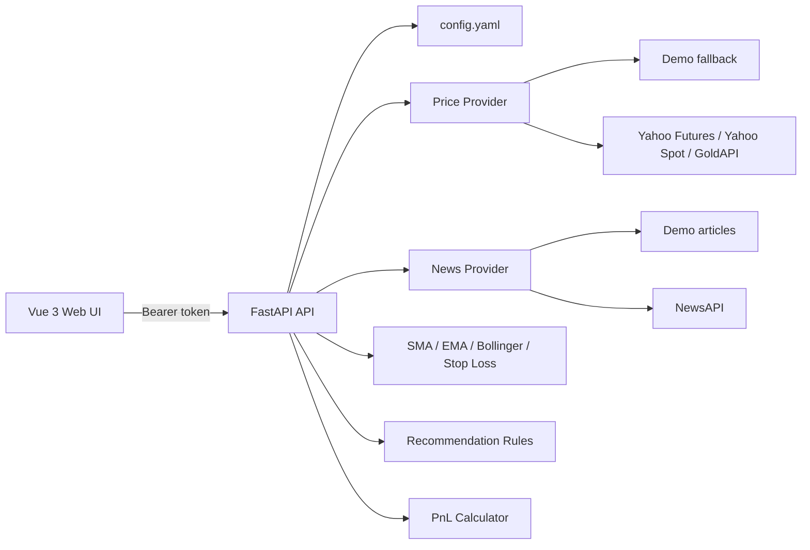

# 系统架构

## 边界

- `frontend/` 只负责展示、用户输入、轮询和连接状态。
- `backend/app/core/` 负责配置、认证和结构化日志。
- `backend/app/services/` 负责可切换价格数据源、新闻情绪、指标、推荐和盈亏计算。
- `config.yaml` 是唯一业务配置入口；密钥不写入 YAML，只通过环境变量注入。

## 实时更新

前端按 `config.yaml -> realtime.frontend_refresh_seconds` 轮询，默认 10 秒。后端按 `max_data_delay_seconds` 校验数据时间戳，默认最大允许延迟 5 秒。若 API 请求失败，后端数据源使用最多 3 次指数退避重试，并记录结构化日志。

## 认证

所有业务 API 均要求 `Authorization: Bearer <token>`。token 来源由 `security.bearer_token_env` 指定，默认读取 `API_AUTH_TOKEN`。开发环境允许使用 `development_token`，生产环境应禁用 `allow_insecure_dev_token`。
